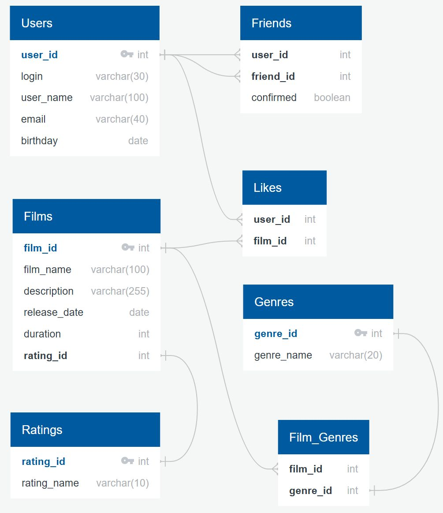

## ER-диаграмма БД Filmorate

https://app.quickdatabasediagrams.com/#/d/UlRdt2



**_База данных хранит в себе данные о фильмах, их жанрах и рейтингах, а также о пользователях, их друзьях и лайках._**

- Таблица **Users** хранит данные о пользователях (логин, имя, email, день рождения).

- Таблица **Friends** хранит данные о друзьях пользователя и статусах их дружбы.

- Таблица **Likes** хранит лайки, поставленные пользователями фильмам.

- Таблица **Films** хранит данные о фильмах (наименование, описание, дата релиза, продолжительность, рейтинг).

- Таблица **Genres** является справочником и хранит наименования жанров.

- Таблица **Film_Genres** хранит данные о жанрах фильма.

- Таблица **Ratings** является справочником и хранит наименования рейтингов.

**Примеры запросов:**

```sql
SELECT * FROM films
```

```sql
SELECT * FROM users
```

```sql
WITH t AS (
SELECT gn.film_id, 
       g.genre_name
  FROM Genres g, Film_Genres gn
 WHERE g.genre_id = gn.genre_id)

SELECT film_name,
       release_date,
       duration,
       (SELECT STRING_AGG(genre_name, ', ' ORDER BY genre_name) FROM t WHERE t.film_id = f.film_id) AS genres,
       description,
       rating_name
  FROM Films f, Ratings r
 WHERE f.rating_id = r.rating_id
```
